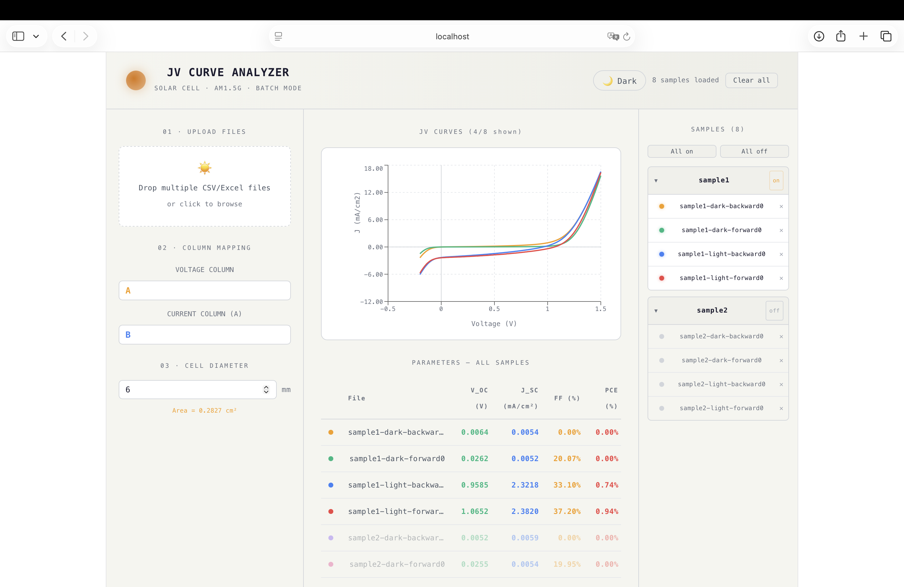

# Solar JV Curve Analyzer

A web-based tool for analysing photovoltaic J-V curves from CSV and Excel files.

## Preview


<p align="center">

  

</p>

## Features

- Import multiple CSV / Excel files

- Plot J-V curves interactively

- Analyse multiple solar-cell samples

- Custom voltage and current column mapping

- Convert current to current density using cell dimensions

- Light and dark mode

- Batch data visualisation

## Tech Stack

- React

- JavaScript

- Vite

- Recharts

- SheetJS (xlsx)

## Motivation

This tool was developed to simplify the analysis of photovoltaic J-V measurements.

It provides a convenient workflow for importing experimental data, visualising J-V curves,

and comparing multiple photovoltaic devices.

## Getting Started

Install dependencies:

```bash

npm install